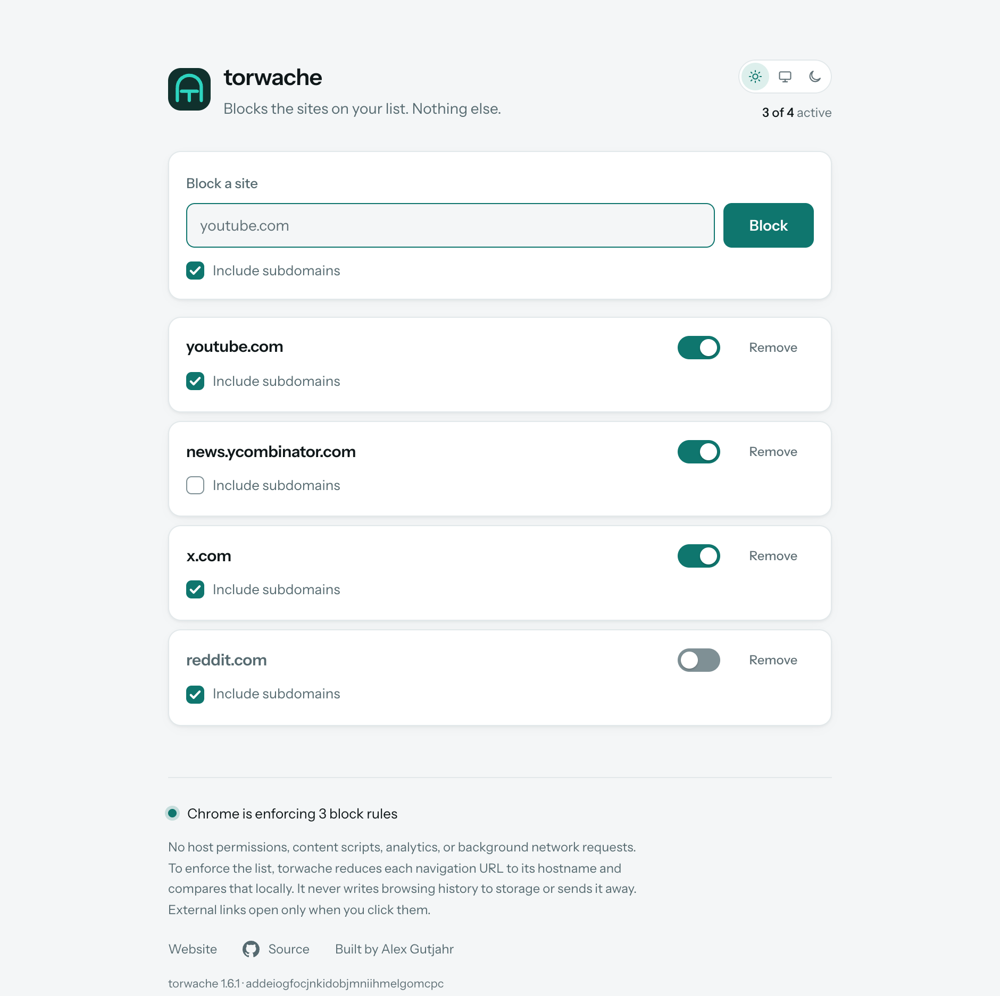
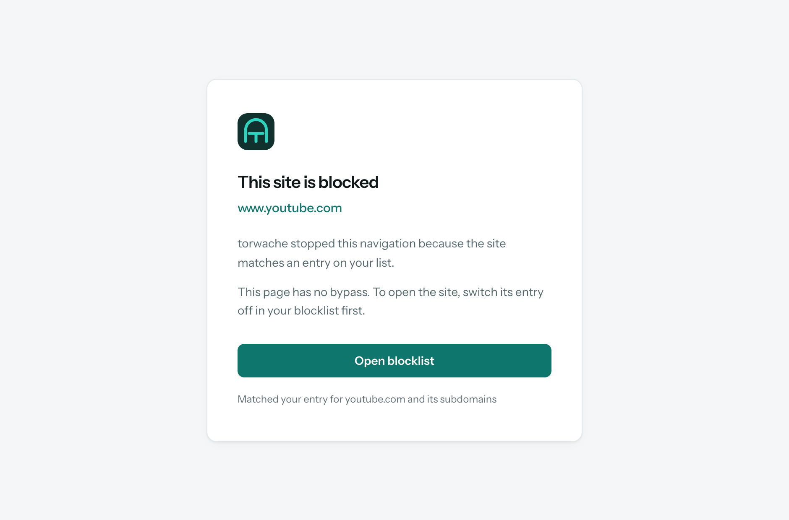

# torwache

A dead-simple website blocker for Chrome.

Official website: [torwache.com](https://torwache.com/)

No tracking. No syncing. No accounts. No onboarding flow. No "upgrade to Pro to unlock
5 more sites". No nonsense. You give it a list of domains, it stops them from opening.
That is the entire product today.

<sub>Three permissions, no host permissions, no content scripts. It cannot read or change
page content, load remote code, or make background network requests. Navigation URLs are checked
locally: paths, queries, fragments, and credentials are discarded synchronously; the hostname is
used for the current check and never written to extension storage or transmitted. See the
[privacy policy](https://torwache.com/privacy/#extension).</sub>

<picture>
  <source media="(prefers-color-scheme: dark)" srcset="docs/manager-dark.png">
  
</picture>

---

## What it does

- Keep a list of domains — `youtube.com`, `news.ycombinator.com`, whatever is eating your day.
- Each entry can be switched **on or off**, set to **include subdomains**, or removed.
- While an entry is on, new page and iframe navigations to it are blocked. You get a plain page
  for blocked top-level navigations; a page that was already open keeps working until it reloads.
- There is no "continue anyway" button. If you want the site, go and switch the entry off.
  That extra ten seconds is the entire point.

Try to open one anyway and you get this, instead of a raw `ERR_BLOCKED_BY_CLIENT`:

<picture>
  <source media="(prefers-color-scheme: dark)" srcset="docs/blocked-dark.png">
  
</picture>

Both screens follow your system light or dark setting, or you can pin one with the
switch in the top right.

## Install

[Add torwache to Chrome](https://chromewebstore.google.com/detail/ibffnlnhgaoppogfnaejknianccnknlj).
Chrome installs store updates automatically.

If you would rather inspect and install a release archive yourself:

1. Grab `torwache-<version>-chrome.zip` from
   [Releases](https://github.com/alexgutjahr/torwache/releases), or clone and run
   `npm install && npm run build`.
2. Verify the checksum (below). It takes five seconds and you should be doing this anyway.
3. Unzip it somewhere permanent — Chrome loads it from that folder every launch, so don't
   unzip into Downloads and then tidy up. **Remember where**: updating means unzipping
   over the same folder, or you get a second install with an empty list.
4. `chrome://extensions` → **Developer mode** → **Load unpacked** → pick the folder.

Whichever route you choose, click the toolbar icon to open your blocklist.

### Verifying the download

Every release ships a `SHA256SUMS` file next to the zip.

```sh
shasum -a 256 -c SHA256SUMS      # macOS / Linux
```

You want `torwache-<version>-chrome.zip: OK`. If you get anything else, don't install it.

## Staying up to date

Chrome Web Store installations update automatically. An unpacked installation does not, so watch
the releases if you installed one manually:

- **Atom/RSS** — `https://github.com/alexgutjahr/torwache/releases.atom` in your feed reader.
  No account or email needed; it is GitHub's plain Atom release feed.
- **GitHub** — the **Watch** button at the top of the repo, then *Custom* → *Releases*.

## FAQ

**Can I sync my blocklist between devices?**
No. It lives in `chrome.storage.local` and stays there. Syncing means an account, or at
minimum handing your list of "sites I can't stop visiting" to Google's sync servers.
Copy it over yourself, it's a list of domains.

**Does the extension run analytics?**
No. There is no telemetry, no error reporting, no "anonymous usage statistics that help us
improve the product". It loads no remote code or assets and makes no background network requests.
The Website, Source, and author links open external pages only when you click them and use
`rel="noreferrer"`.

**Can you see my traffic?**
The developer cannot. The extension has no host permissions or content scripts and cannot
read page content, but Chrome does deliver navigation URLs to it through `webNavigation`.
The code immediately reduces each URL to its hostname; paths, queries, fragments, and credentials
do not survive the synchronous parse. The hostname is used in memory for the current check and,
when blocked, shown on the local blocked page. torwache never writes browsing history to extension
storage or transmits it. The full details are in the
[privacy policy](https://torwache.com/privacy/#extension).

**Will an update wipe my blocklist?**
No, as long as you unzip over the same folder. Chrome derives an unpacked extension's id
from its folder path and your list is stored against that id, so unzipping somewhere new
gives you a second install with an empty list while the old one sits there still enabled.

**Do I need an account?**
No.

**Is there a paid tier?**
No. The current release is free and contains no trial, licence key, or upgrade screen.

**Does it have a dashboard, streaks, focus scores, or a productivity graph?**
No. It blocks websites.

**Will it ask for more permissions in an update?**
The current release asks for three permissions and needs all three. If a future update adds a
permission that triggers a warning, Chrome requires you to approve it before the extension can run
again. Read that prompt carefully—for anyone's extension, not just this one.

**Is there a bypass on the block page?**
No. There is no bypass button, timer, or "5 more minutes" action. Open the list and switch the
entry off if you mean it.

**Can I lock myself out by blocking the blocklist?**
No. The blocklist lives on a `chrome-extension://` address, and only `http` and `https`
are ever considered for blocking. An extension id has no dot in it either, so it cannot be
entered as a domain in the first place. There is a test for this.

**Should I trust a random blocker from the internet?**
No! That is rather the point. The runtime is a small set of readable TypeScript modules. Its
only production dependency is `tldts`, which uses the maintained Public Suffix List to stop a
mistake like adding `co.uk` from blocking unrelated sites. WXT and Vite are build tools only.
Read the source—the security and privacy properties are much easier to trust when they are
visible in code.

## When a blocked site still loads

The bottom of the blocklist says what Chrome is actually enforcing, rather than what the
list thinks. Check that first:

```
torwache <version> · odlcekiojdmooeaipdcbpkgpaiclefbk
Chrome is enforcing 3 block rules.
```

- **Fewer rules than entries switched on.** The line turns red and says so. The list and
  Chrome have gone out of step; reload the extension on `chrome://extensions`.
- **Rule count looks right, site still loads.** Compare the id on that line with the one
  shown on `chrome://extensions`. The same files loaded from two folders are two separate
  installs with separate lists, and it is easy to edit one while the other is the one
  actually enabled.
- **Nothing blocked in Incognito.** Extensions are disabled there by default. Turn on
  *Allow in Incognito* if you want it.
- **Another extension may win.** Chrome arbitrates between extensions' rules, so an ad
  blocker or privacy tool with an allow rule for the same domain can override a block.
  Disable the others to find out.
- **The tab was already open.** Expected, see below. It is blocked once it reloads.

## Permissions

Three, and no host permissions at all:

| Permission | Why |
| --- | --- |
| `storage` | Keeps your list on this device. |
| `declarativeNetRequest` | Hands Chrome the domains to refuse. Chrome enforces these rules in its network stack. |
| `webNavigation` | Receives navigation events so cached navigations are still blocked and a readable local page can replace Chrome's raw error. Full URLs are reduced to hostnames and never persisted or transmitted. |

No `host_permissions`. No `tabs`. No content scripts. The extension cannot read or modify
page content and never transmits the navigation URLs Chrome delivers to it.

## It does not close tabs you already have open

If YouTube is open and you block it, that tab keeps working until you reload or navigate.
This is deliberate.

Blocking applies to *requests*, and an open page has already made its request. To shut it
down retroactively the extension would have to enumerate every open tab and inspect its
current URL. torwache deliberately does not request `tabs` access or perform that scan simply
to save you one Cmd-W.

The next reload or new-document navigation to the blocked domain is blocked.

## How the blocking works

Two layers, because neither one catches everything:

1. **`declarativeNetRequest`** holds one rule per active entry. Chrome enforces these inside
   the network stack, so a blocked request never leaves your machine. It keeps working while
   the extension's service worker is asleep, and there is nothing on the page for a script to
   bypass, because no page is ever loaded.
2. **`webNavigation`** receives navigation events directly, one layer above the network. This is not
   cosmetic. Chrome's own documentation notes that network rules "won't affect responses
   generated by the service worker or retrieved from CacheStorage" — so a site that answers
   its own navigation from its service worker cache never becomes a network request at all,
   and layer 1 cannot see it. YouTube does this. `webNavigation` catches those, and also
   swaps Chrome's raw `ERR_BLOCKED_BY_CLIENT` error page for a readable one. Each full URL is
   synchronously reduced to a hostname for the local check; only a blocked hostname is passed to
   the internal page, and browsing history is never persisted or transmitted.

Entries with *include subdomains* use a `requestDomains` condition, which matches on label
boundaries — `youtube.com` covers `m.youtube.com`, never `notyoutube.com`. Entries without it
use an anchored `regexFilter` matching that host alone.

`www` is always treated as the same site. Typing or pasting `www.youtube.com` stores
`youtube.com`, and even a narrow entry for `youtube.com` covers `www.youtube.com`. Without
that, blocking `youtube.com` with subdomains off would quietly let YouTube through, since
`www` is the host it actually serves from.

Redirects are covered too: every hop is its own request, so a redirect landing on a blocked
host is stopped at that hop.

Rules apply to page and iframe navigations, not to individual sub-resources. Blocking
`youtube.com` does not break unrelated pages that merely link to it.

## Build from source

Requires Node.js 24.

```sh
npm install
npm run dev           # WXT opens Chrome with live extension reloads
npm run build         # production extension in .output/chrome-mv3
npm run check         # lint + strict typecheck + unit, Chrome, and Astro tests
npm run lint          # Biome
npm run build:icons   # regenerate SVG and PNG icons from the shared DESIGN
npm run screenshots   # regenerate the README and ignored Store images in Chrome
npm run package       # checked WXT ZIP + .output/SHA256SUMS
npm run website:dev   # start the Astro site in background mode
npm run website:build # build torwache.com to website/dist
```

For a manual production install, load `.output/chrome-mv3/` as above. For development,
`npm run dev` gives WXT its own browser profile, loads the extension, and reloads it as the
source changes.

`npm run package` produces one Chrome ZIP with `manifest.json` at its root. That exact archive is
used for both the GitHub release and the Chrome Web Store upload; the Store does not need a CRX or
a separately built package.

```
extension/            typed source compiled by WXT
  entrypoints/
    background.ts     service worker: keeps rules in step, shows the blocked page
    options/          the blocklist UI
    blocked/          the page shown instead of a blocked site
    theme.ts          synchronous pre-paint theme selection
  lib/domains.ts      PSL-aware parsing, matching, and rule building, unit tested
  lib/store.ts        atomic mutations plus declarativeNetRequest synchronization
  lib/protocol.ts     versioned, validated manager/service-worker messages
  lib/dom.ts          typed element lookup
  lib/blocked-page.ts the blocked page's address, in one place
  lib/navigation-guard.ts stale-safe navigation sequencing, unit tested
  css/                fonts, Tailwind aliases, base styles, and reusable components
  public/             bundled font, licence, source icons, and SVG mark
shared/styles/        product tokens consumed by both extension and website
.output/chrome-mv3/   generated unpacked production extension
docs/                 the screenshots above
  store/               ignored Chrome Web Store screenshots generated with the README images
test/                 typed unit tests and real-Chrome tests; the manifest test fails
                      the build if the extension ever gains an unexpected permission
tools/                icon generator, screenshot task, and release checksum helper
website/              the static Astro site served at torwache.com
  middleware.ts       HTML/Markdown negotiation and agent-friendly error responses
  scripts/            generated Markdown representations of the built HTML pages
  src/pages/          landing, trust, guide, comparison, legal, and 404 pages
  src/styles/         site-only tokens, bundled fonts, and global/preview layout
```

WXT generates the Manifest V3 file from the typed configuration, bundles the TypeScript
entrypoints with Vite, and provisions an isolated Chrome profile during development. It does
not ship a runtime framework: Chrome receives small browser-native JavaScript, HTML, CSS, and
the local assets visible in `.output/chrome-mv3/`.

The website imports the extension's mark, Instrument Sans file, component CSS, and the shared
product tokens directly. Its product previews therefore use the same cards, fields, buttons,
switches, checkboxes, status dot, and icon as the extension instead of maintaining replicas.

The repository checks also run Biome's recommended rules, reject unused code, strictly check the
Astro site, and exercise the unpacked extension in Chrome.

## Known limits

- Blocking covers page and iframe navigations, not individual sub-resources.
- Already-open tabs keep working until they navigate. See above.
- Internationalised domains are stored and shown in punycode (`xn--…`).
- Active entries are subject to Chrome's dynamic-rule and regular-expression rule capacities;
  torwache checks the limits Chrome exposes and reports when one is reached.
- The list is local and does not sync. On purpose.

## Licence

[Zero-Clause BSD](LICENSE). It permits use, copying, modification, and distribution for any
purpose, with or without a fee, and has no attribution condition. It provides the software without
warranty; read the short licence text for the exact terms.

Third-party assets keep their own terms:

- Instrument Sans is under the SIL Open Font License, with its terms in
  `extension/public/fonts/OFL.txt`.
- Instrument Serif is under the SIL Open Font License, with its terms in
  `website/src/fonts/OFL-InstrumentSerif.txt`.
- The GitHub mark in the extension footer is from
  [Octicons](https://github.com/primer/octicons), MIT licensed, copyright GitHub Inc.
- The website's Chrome and GitHub glyphs come from
  [Simple Icons](https://github.com/simple-icons/simple-icons), released under CC0 1.0. Product
  names and marks remain the property of their respective owners.
